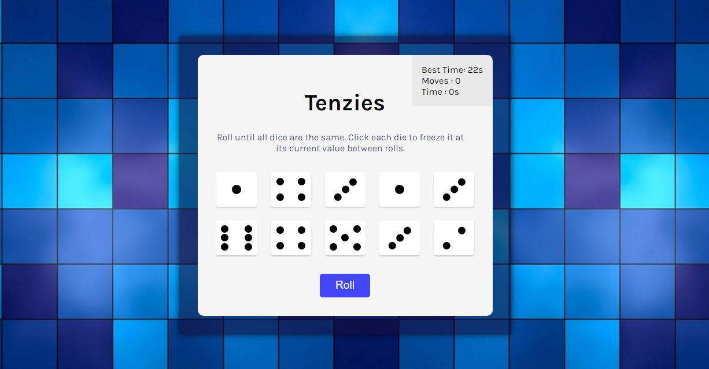
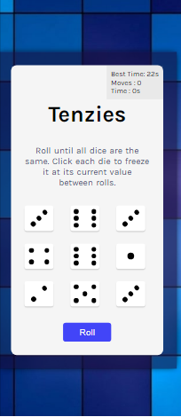

# Tenzie Game 

## Overview

In the Tenzie Game, you have to roll until all dice are the same and click each die to freeze it at its current value between rolls. It's a engaging, fun and fast game. Your Best Time will be stored in your browser so your Best Time is secured.

### Screenshot

  

### Links

- Live Site URL: [Tenzie Game Web App](https://tenzie-io.netlify.app/)

## My process

### Built with

- Semantic HTML5 markup
- CSS custom properties
- Flexbox
- CSS Grid
- JavaScript Local Storage 
- [React](https://reactjs.org/) - JS library
- React Confetti 

### What I learned

I have learnt - 
      - how to make die (1, 2, 3, 4, 5, 6) based on their value.
      - how to use localStorage to save user best time.
      - how to make timer count and moves count.
      - a lot of about conditional rendering in ReactJS.

## Author

- Website - [Sagar Sharma]()
